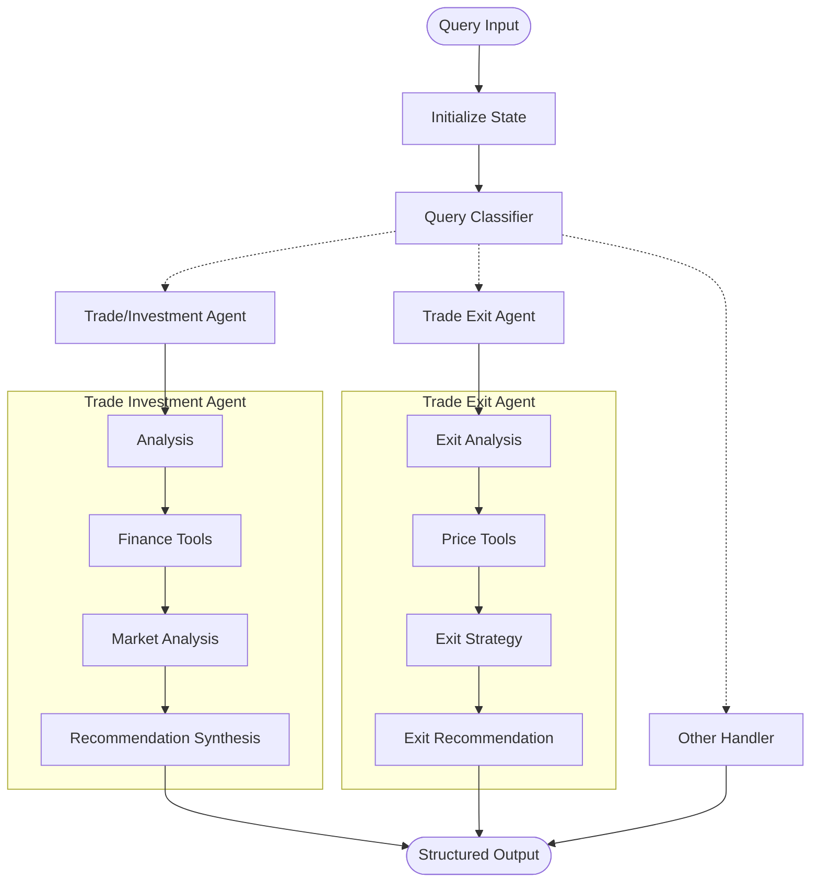

## 🤖 STONKS: Specialist Trading/Investing Operations with Neural Knowledge Agentic System 🤖

# UiPath SDK · LangChain · LangGraph · OpenAI · FastAPI · Python

## 🧾 Overview

The Trading & Investment Agent is an intelligent automation bot built using LangChain, LangGraph, and the UiPath Python SDK. It provides comprehensive trading and investment analysis by processing financial queries and delivering actionable insights including:

📈 **Stock Price Analysis** 📊 **Market Data Processing** 📰 **News Sentiment Analysis** 💹 **Trade Recommendations** 🚪 **Exit Strategy Analysis**

The agent intelligently routes queries between specialized sub-agents and provides structured analysis with buy/sell recommendations, risk assessments, and optimal entry/exit points.

## ⚙️ Architecture

The system uses a multi-agent architecture built on LangGraph's StateGraph:



**Architecture Flow:**
1. **Query Processing** - FastAPI endpoint receives trading queries
2. **Intelligent Routing** - LangGraph classifier determines query type and routes to appropriate agent
3. **Data Aggregation** - Agents fetch real-time market data, news, and financial metrics
4. **AI Analysis** - GPT-4 processes data and generates insights
5. **Structured Output** - Returns JSON recommendations with risk assessments and trade parameters

## 🚀 Key Features

| Feature | Technology | Description |
|---------|------------|-------------|
| **Multi-Agent System** | LangGraph StateGraph | Intelligent query routing between specialized agents |
| **Real-Time Market Data** | FinancialDatasets API, Polygon, Twelvedata | Live stock prices, market metrics, and financial data |
| **News Sentiment Analysis** | NewsAPI Integration | Market sentiment analysis from financial news |
| **Trade Recommendations** | OpenAI GPT-4 | AI-powered buy/sell decisions with risk assessment |
| **Exit Strategy Analysis** | Custom Exit Agent | Specialized agent for trade exit timing and strategies |
| **Caching System** | ChromaDB + Custom Cache | Optimized data retrieval with intelligent caching |
| **UiPath Integration** | UiPath SDK, Context Grounding, Maestro | Enterprise automation and workflow integration |
| **REST API** | FastAPI | RESTful endpoints for easy integration |
| **RAG Capabilities** | UiPath Context Grounding | ChromaDB + OpenAI | Document-based context and knowledge retrieval |

## 🧩 Getting Started

### 🔧 Prerequisites

Before you begin, ensure you have the following:

**System Requirements:**
- ✅ Python 3.10+
- ✅ Access to UiPath Orchestrator

**API Access:**
- ✅ OpenAI API Key (GPT-4 access recommended)
- ✅ FinancialDatasets.ai API Key
- ✅ NewsAPI Key

**UiPath Setup:**
- ✅ UiPath Orchestrator org and tenant access

### 📦 Installation

#### 1️⃣ Clone the Repository
```bash
git clone <your-repository-url>
cd agents-trading-investing-backendonly
```

#### 2️⃣ Create Virtual Environment
```bash
python -m venv venv
source venv/bin/activate  # On Windows: venv\Scripts\activate
```

#### 3️⃣ Install Dependencies
```bash
pip install -r requirements.txt
```

#### 4️⃣ Set up Environment Variables
Create a `.env` file in the `backend/` directory:

```env
# OpenAI Configuration
OPENAI_API_KEY=your_openai_api_key

# Financial Data APIs
FINANCIAL_DATASETS_API_KEY=your_financial_datasets_api_key
NEWS_API_KEY=your_news_api_key

# UiPath Orchestrator Configuration
UIPATH_CLIENT_ID=your_client_id
UIPATH_CLIENT_SECRET=your_client_secret
UIPATH_URL=https://cloud.uipath.com/
UIPATH_ACCESS_TOKEN=your_access_token

# LangSmith (Optional - for monitoring)
LANGSMITH_API_KEY=your_langsmith_api_key
LANGSMITH_PROJECT=trading-investing-agent

# Additional APIs (Optional)
POLYGON_API_KEY=your_polygon_api_key
TWELVE_DATA_API_KEY=your_twelve_data_api_key
```

#### 5️⃣ Initialize ChromaDB
The system will automatically initialize the ChromaDB vector database on first run.

#### 6️⃣ Authenticate with UiPath
```bash
cd backend
uipath auth --client-id your_client_id --client-secret your_client_secret
```

#### 7️⃣ Package the Project
```bash
uipath pack
```

#### 8️⃣ Publish to UiPath Orchestrator
```bash
uipath publish
```

## 🚀 Usage

### Local Development

#### Start the FastAPI Server
```bash
cd backend
python web_server.py
```

The API will be available at `http://localhost:8000`

#### API Endpoints

**Trading Analysis:**
```bash
POST /trading-query
{
    "query": "Should I buy AAPL stock today?",
    "date_of_trade": "2024-10-26",
    "trade_capital": 10000
}
```

**Exit Analysis:**
```bash
POST /exit-analysis  
{
    "query": "When should I exit my TSLA position?",
    "ticker_symbol": "TSLA",
    "date_of_trade": "2024-10-26"
}
```

### UiPath Deployment

#### Run via UiPath CLI
```bash
uipath run trading_system -f input.json
```

**Sample input.json:**
```json
{
    "query": "Analyze NVDA for a swing trade",
    "date_of_trade": "2024-10-26",
    "trade_capital": 50000
}
```

## 📁 Project Structure

```
backend/
├── agents/
│   ├── main_graph.py          # Main routing and orchestration
│   ├── trade_invest_agent.py  # Investment analysis agent
│   ├── trade_exit_agent.py    # Exit strategy agent
│   └── utils/
│       ├── prompt_templates.py # AI prompts and templates
│       └── utils.py           # Utility functions
├── services/
│   ├── finance_data.py        # Financial data service
│   ├── news_data.py          # News data service
│   ├── rag_service.py        # RAG and vector operations
│   ├── cache_service.py      # Intelligent caching
│   └── uipath/
│       └── job_service.py    # UiPath integration
├── tools/
│   ├── quant/
│   │   ├── finance_tools.py  # Financial analysis tools
│   │   └── news_tools.py     # News analysis tools
│   └── default/
│       └── rag_tools.py      # RAG and search tools
├── web_server.py             # FastAPI application
├── langgraph.json           # LangGraph configuration
├── uipath.json             # UiPath deployment config
└── requirements.txt        # Python dependencies
```

## 🔧 Configuration

### Agent Configuration
The system uses LangGraph for agent orchestration. Key configuration files:

- `langgraph.json` - LangGraph deployment settings
- `uipath.json` - UiPath integration configuration
- `.env` - Environment variables and API keys

### Caching Strategy
The system implements intelligent caching for:
- Market data (5-minute cache for real-time data)
- News articles (30-minute cache)
- Analysis results (1-hour cache for similar queries)

## 📊 Sample Outputs

### Trading Recommendation
```json
{
  "query_type": "trading",
  "trading_response": {
    "analysis": "Strong earnings momentum, bullish technical patterns, and positive market sentiment support a buy recommendation with defined risk parameters",
    "instrument_type": "STOCKS",
    "symbol": "AAPL",
    "action_recommendation": "BUY",
    "entry_price": 175.25,
    "stop_loss": 165.00,
    "target_price": 185.50,
    "entry_time_date": "2024-10-26",
    "quantity": 57,
    "options_strike_price": null,
    "options_expiry": null
  }
}
```

### Investment Analysis
```json
{
  "query_type": "investment",
  "investment_response": {
    "symbol": "AAPL",
    "summary": "Apple demonstrates strong fundamentals with consistent revenue growth and market leadership position, suitable for long-term investment",
    "valuation": {
      "method": "P/E",
      "insight": "Currently trading at reasonable valuation relative to growth prospects"
    },
    "fundamentals": {
      "revenue_growth": "8.2%",
      "profit_margin": "23.5%",
      "debt_to_equity": "1.73"
    },
    "risks": [
      "Regulatory pressures in key markets",
      "Supply chain dependencies",
      "Market saturation in core products"
    ],
    "recommendation": {
      "action": "BUY",
      "target_price": 200.00,
      "time_horizon": "12-18 months"
    }
  }
}
```

### Exit Analysis
```json
{
  "entry_trade": {
    "time": "09:30:00",
    "date": "2024-10-20",
    "quantity": 100,
    "symbol": "AAPL",
    "side": "BUY",
    "price": 175.25
  },
  "exit_trade": {
    "time": "14:15:00",
    "date": "2024-10-23",
    "quantity": 100,
    "symbol": "AAPL",
    "side": "SELL",
    "price": 185.50
  },
  "exit_reason": "Target Hit",
  "r_multiple": 2.1,
  "profit_loss": 1025.00
}
```

## 🔍 Monitoring & Debugging

### UiPath Orchestrator Integration
The system provides comprehensive monitoring through UiPath Orchestrator:
- **Job Execution Logs** - Detailed execution traces for each agent run
- **Agent Performance Metrics** - Response times, success rates, and throughput analysis
- **Audit Trail** - Complete audit history of all trading recommendations and decisions
- **Real-time Monitoring** - Live job status and queue management
- **Error Tracking** - Centralized error logging with stack traces and context

### Enterprise Logging
Multi-level logging system designed for production environments:
- **Application Logs** - Agent decision processes and reasoning chains
- **API Integration Logs** - External service calls and response validation
- **Trade Execution Logs** - Complete trade recommendation audit trail
- **System Performance Logs** - Infrastructure metrics and health checks
- **Security Audit Logs** - Authentication events and access patterns

## 🤝 Contributing

1. Fork the repository
2. Create a feature branch (`git checkout -b feature/amazing-feature`)
3. Commit your changes (`git commit -m 'Add amazing feature'`)
4. Push to the branch (`git push origin feature/amazing-feature`)
5. Open a Pull Request

## 📄 License

This project is licensed under the MIT License - see the LICENSE file for details.

## 🆘 Support

For support and questions:
- Create an issue in this repository, or;
- Reach out to me via linkedin https://linkedin.com/in/russel-alfeche

## 🏗️ Roadmap

- [ ] Additional data sources integration
- [ ] Additional technical analysis indicators
- [ ] Portfolio management features
- [ ] Mobile app integration
- [ ] Real-time alerts and notifications

---

**Built with ❤️ using UiPath, LangChain, LangGraph**